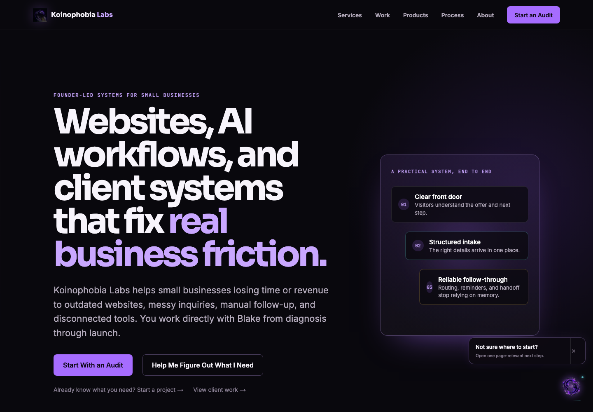
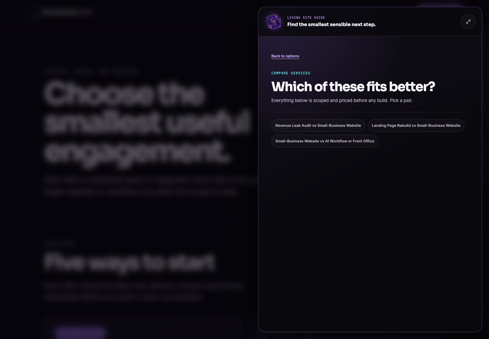
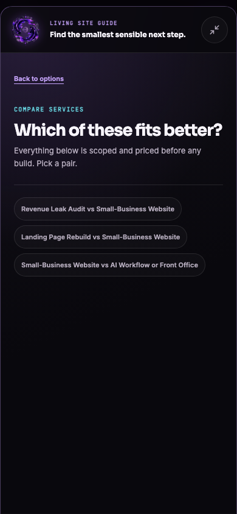

# Site-wide Koi Companion Mission Audit

Date: 2026-07-20

## Existing source-of-truth audit

| Area | Existing infrastructure kept authoritative | Companion integration |
| --- | --- | --- |
| Concierge route | `/concierge` renders the shared `ConciergeFlow`. | The in-page panel lazy-loads that same component; it does not clone the questions or recommendation logic. |
| Lead schema | `ConciergeLeadData` is embedded in the existing intake payload and persisted with the lead. | The signed handoff and intake prefill retain the established schema; no migration or parallel lead object was added. |
| Evaluation and routing | `/api/concierge/evaluate` validates input and computes the deterministic route, confidence, reasons, prices, and next action. | The companion submits to the same endpoint and preserves the backend result as authoritative. |
| Notifications | The intake route stores the lead, formats the established notification, sends through Resend with the visitor reply-to, and retains the existing CRM fallback behavior. | No recipient, notification template, or delivery rule changed. |
| Analytics | `trackStudioEvent` feeds the site's existing analytics bridge and Vercel-compatible categorical event path. | Companion events use that hook and exclude questions, names, contact data, and CRM IDs. |
| Shared layout and navigation | The root layout owns the global site chrome; `StudioNav` owns desktop and mobile navigation behavior. | One fixed companion controller is mounted at the root and suppresses itself on private, transactional, unknown, and full-page concierge routes. |
| Animation and accessibility | The site already uses CSS motion, safe-area spacing, focus styles, and reduced-motion overrides. | Koi drift is mathematically bounded, collision-aware, paused during interaction, and removed under reduced motion. The dialog traps and restores focus, supports Escape, and exposes semantic labels/status. |

## Gaps found before implementation

- The browser harness still asserted an older full-viewport cursor-chasing behavior even though the shipped motion model was anchored.
- The floating trigger used a single Trendi fish instead of the official transparent two-koi Koinophobia Labs identity.
- Route invitations led to a general menu instead of immediately providing the one page-relevant action promised by the invitation.
- There was no deterministic high-intent offer after meaningful multi-page browsing.
- Concierge answers were stored origin-wide in `localStorage`, allowing a newly opened tab to inherit another tab's unfinished lead answers.

## Implementation decisions

- `/services` opens service comparison, `/work` opens relevant proof, `/audit` opens concrete revenue-leak examples, and `/products` opens the products-versus-client-services explanation.
- Meaningful engagement requires at least eight seconds and 30% scroll depth on each of two commercial routes. Only then can one session-budgeted project-plan invitation appear.
- Opening that plan invitation launches the existing concierge in place. Evaluation, signed handoff, intake prefill, CRM storage, and notification delivery remain unchanged.
- Drafts now use versioned, tab-scoped `sessionStorage`, persist through same-tab navigation and refresh, and are cleared after submission. The legacy origin-wide draft is deleted during migration.
- The trigger uses the existing official two-koi transparent brand asset, controlled violet glow, no attached rectangle, bounded drift, collision hiding, and a motion-free reduced-motion state.

## Conversion rationale without widget noise

The companion reduces the visitor's first decision from “understand the whole studio” to one contextual action. It connects service ambiguity to comparison, work browsing to relevant proof, audit interest to recognizable leak patterns, and product interest to a clear services distinction. The project-plan invitation waits for demonstrated interest instead of interrupting arrival. A two-invitation session cap, cooldown, route deduplication, dismissal controls, safe zones, and route suppression keep the experience subordinate to primary content.

## Deterministic verification

| Gate | Result |
| --- | --- |
| Concierge, companion, site knowledge, draft isolation, handoff, analytics, and unavailable-backend tests | 62/62 pass |
| Commercial contract tests | 6/6 pass |
| Existing concierge Chromium journey | 12/12 pass |
| Companion Chromium + WebKit desktop/mobile journeys | 46/46 pass |
| Visual capture matrix | 19 states; no horizontal overflow |
| TypeScript | pass |
| ESLint | 0 errors; one pre-existing `_random` warning in `lib/trendiHero.ts` |
| Next.js production build | pass; 39 pages generated |

The browser journey covers first invitation, route-direct help, meaningful-browsing plan offer, preserved draft navigation, evaluation fallback, keyboard focus/return, Escape, reduced motion, mobile safe areas, intake prefill, and a controlled successful `/api/intake` response. It does not send a real lead or external email from local QA; CRM and notification behavior remain covered at the existing deterministic server boundary and should receive one controlled production smoke after deployment.

## Rendered evidence

### Desktop invitation

### Desktop service comparison

### Mobile service comparison

